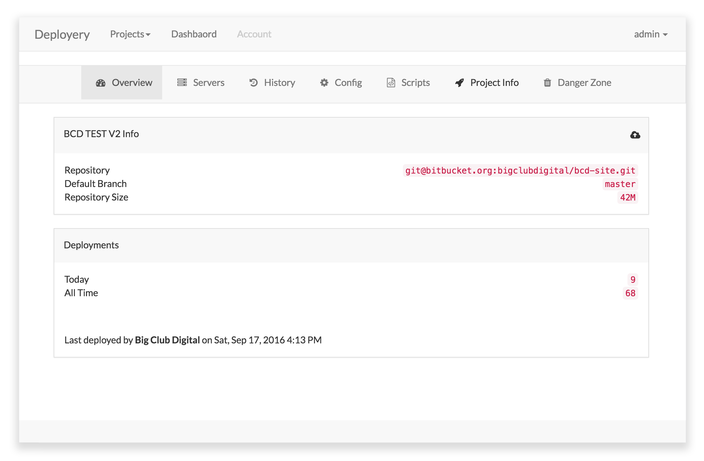

## Deployery (v0.2)

Deployery is a simple web app that allows you to auto-deploy your code from git repositories to web hosts.

####It currently supports

- configuration file uploads
- pre/post deploy scripts
- webhook deployment
- multiple environment projects (production, stage, development...)



Best of all it's free as in beer.

We've got the core, and now we're looking to extend the project based on the community's needs. Please fork, improve, and send PR's.

Have suggestons? Take a look at the [Roadmap](./docs/roadmap.md) we'd love to add them.

## Status
[](https://scrutinizer-ci.com/g/eahrold/Deployery/?branch=master)
[](https://scrutinizer-ci.com/g/eahrold/Deployery/build-status/master)


## Server Requirements
- [Everything Laravel 5.3 Needs](https://laravel.com/docs/master)
- [Git > 2.0](https://git-scm.com)
- [Supervisord](http://supervisord.org)
- [A Pusher account](https://pusher.com)

## Setup

- Clone repo
- Run: `composer install`
- Run: `php artisan deployery:setup`
- Configure Apache / Nginx
- Setup supervisord to run the queues

## Queues
There are 3 queues that need to be configured

Each with a corresponding artisan command to use for testing.

``` bash
php artisan deployery:queue:clones
php artisan deployery:queue:deployments
php artisan deployery:queue:progress
```

You'll also find supervisor config files in the [./docs/examples/]() folder

- [default / progress](./docs/examples/supervisord.deployery.progress.conf)
- [clones](./docs/examples/supervisord.deployery.clones.conf)
- [deployments](./docs/examples/supervisord.deployery.deployments.conf)

## Contributing
PR's welcome.

Please make PR's to the development branch.

We try to adhere to [Laravel's coding standards](https://laravel.com/docs/5.3/contributions#coding-style). However when extending library classes, it's OK to conform to the parent's style. Just try to keep consistent.

_This Project is early stage active development, breaking changes are likely until v1.0._

## License
Licensed under the [MIT license](http://opensource.org/licenses/MIT).

## Credits
This project takes advantage of numerous open source projects.

- [Laravel](https://github.com/laravel/laravel)
- [Dingo API](https://github.com/dingo/api)
- [JWT Auth](https://github.com/tymondesigns/jwt-auth)
- [Laravel Collective Remote](https://github.com/LaravelCollective/remote)
- [Laravel Debugbar](https://github.com/barryvdh/laravel-debugbar)
- [PHP Shell Wrapper](https://github.com/adambrett/php-shell-wrapper)
- [Bootforms](https://github.com/adamwathan/bootforms)
- [Teamwork](https://github.com/mpociot/teamwork)
- [Vue.js](https://github.com/vuejs/vue)

And numerous other includes.

A special thanks to Samuel De Backer for [TypiCMS](http://typicms.org), an awesome Laravel based CMS, that was often referred to, and borrowed from.

---

__Big Club Digital__ is a St. Louis development house.
Check us out online [https://bigclubdigital.com](https://bigclubdigital.com)
